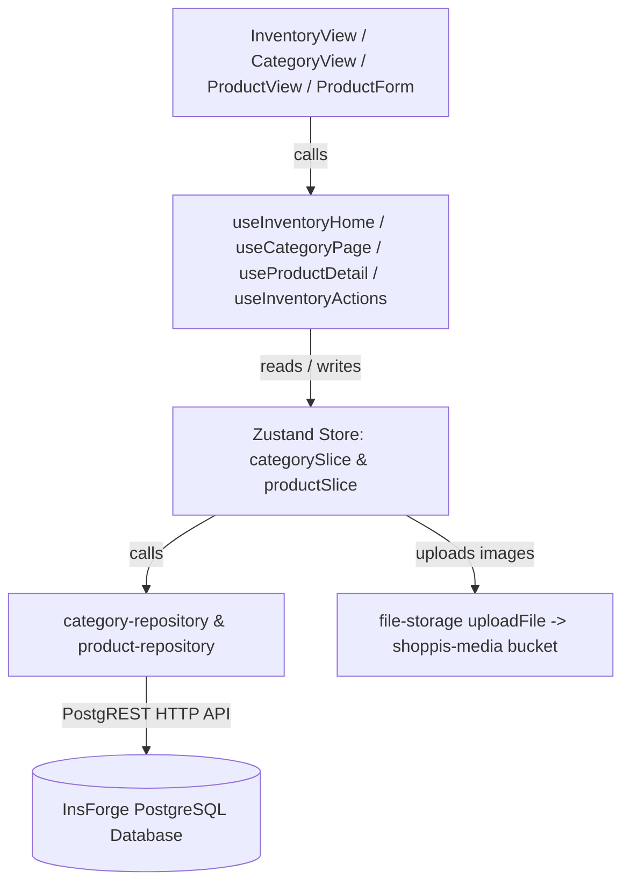

# План перехода инвентаря с моков на реальную БД InsForge

> **Статус: выполнен (2026-09-29).** Инвентарь продавца работает на реальном InsForge
> (PostgreSQL + PostgREST + Storage `shoppis-media`). In-memory мок-слой `src/mock` удалён.
> Детали реализации и отклонения от исходного плана — в разделе
> [«Итог реализации»](#итог-реализации) в конце документа.

## Описание задачи
Перевести весь блок управления инвентарём продавца (`/seller/inventory`), создания/редактирования категорий, создания/редактирования карточек товаров, управления остатками (Stock Control) и загрузки медиафайлов с локального in-memory мока (`src/mock/inventory/*`) на реальный бэкенд **InsForge** (PostgreSQL + PostgREST + Object Storage `shoppis-media`).

---

## Текущее состояние и анализ моков

1. **Где сейчас сосредоточены моки**:
   - `src/mock/inventory/store.ts` — in-memory хранилище `mockInventoryStore`, содержащее фикстурные записи и методы `addCategory`, `updateCategory`, `addProduct`, `updateProduct`, `setProductStatus`, `deleteProduct`, `updateVariantStock`, `addVariant`.
   - `src/mock/inventory/types.ts` — типы UI вью-моделей (`InventoryCategoryItem`, `InventoryProductItem`, `InventoryProductDetail`, `InventoryVariantItem`, `NewMockProduct`, `UpdateVariantStockPatch`).
   - `src/mock/inventory/index.ts` — функции проекции данных: `mockCategoryItems`, `mockProductItems`, `mockCategoryItem`, `mockProductDetail`.
   - `src/application/hooks/useInventory.ts` — использует `mockInventoryStore` через `useSyncExternalStore`.
   - `src/application/hooks/useInventoryActions.ts` — все мутации вызывают методы `mockInventoryStore`.
   - `src/application/hooks/useCategory.ts` — экран категории подписан на `mockInventoryStore`.
   - `src/application/hooks/useProduct.ts` — карточка товара подписана на `mockInventoryStore`.

2. **Что уже готово в инфраструктуре и БД**:
   - В PostgreSQL InsForge уже созданы таблицы: `stores`, `categories`, `products`, `variants`, `inventory`, `product_images`, `product_attributes`, `product_link_attributes`.
   - Мы уже дополнили `categories` полями `image_storage_key TEXT` и `low_stock_threshold INTEGER`, а также `products` полем `sku TEXT`.
   - Есть репозитории: `src/infrastructure/repositories/category-repository.ts` и `src/infrastructure/repositories/product-repository.ts`.
   - В Zustand уже есть слайсы `category-slice.ts` и `product-slice.ts`, которые вызывают эти репозитории.
   - Есть хранилище файлов `src/infrastructure/storage/file-storage.ts` (`uploadFile` в публичный бакет `shoppis-media`).

3. **Что требует доработки**:
   - **Загрузка фото**: В `ProductForm.tsx`, `CreateCategoryView.tsx` и `EditCategorySheet.tsx` сейчас создаются локальные `blob:` URL через `URL.createObjectURL`. Их нужно загружать в реальный бакет `shoppis-media` через `uploadFile`, сохраняя постоянный URL.
   - **Репозитории**:
     - В `category-repository.ts` нужно добавить полноценную поддержку `image_storage_key`, `low_stock_threshold` и метод `updateCategory`.
     - В `product-repository.ts` нужно поддержать поле `sku`, а также методы атомарного изменения остатков (`updateVariantStock`, `addVariantToProduct`).
   - **Слайсы Zustand**:
     - В `category-slice.ts` добавить `updateCategory`.
     - В `product-slice.ts` добавить `updateVariantStock`, `addVariant`, `moveHeldToAvailable`.
   - **Хуки**:
     - `useInventoryHome`: перевести на чтение из Zustand `useStore` (`products`, `categories`, `variants`, `inventories`, `images`), с автозагрузкой при наличии `storeId`.
     - `useCategoryPage`: перевести на выборку из реального каталога `useStore`.
     - `useProductDetail`: сформировать детальную модель `InventoryProductDetail` из реальных таблиц `products`, `variants`, `inventory`, `product_images`, `product_attributes`.
     - `useInventoryActions`: перенаправить все вызовы (`createCategory`, `updateCategory`, `createProduct`, `updateProduct`, `setProductStatus`, `deleteProduct`, `updateVariantStock`, `addVariant`, `moveHeldToAvailable`) на методы слайсов Zustand / репозитории с отправкой в InsForge.
   - **Типы**: Вынести вью-модели инвентаря из `src/mock/inventory/types.ts` в `src/domain/models/inventory-view.ts` (с обратной совместимостью реэкспортов).

---

## Архитектура потока данных



---

## Предлагаемые изменения

### 1. Доменная модель и типы вью-моделей
#### [NEW] `src/domain/models/inventory-view.ts`
Перенести все интерфейсы отображения из `mock/inventory/types.ts`:
- `InventoryCategoryItem`
- `InventoryProductItem`
- `InventoryVariantItem`
- `InventoryProductDetail`
- `ProductFormPayload`
- `UpdateVariantStockPatch`

#### [MODIFY] `src/domain/models/category.ts`
- Подтвердить наличие полей `imageStorageKey?: string | null;` и `lowStockThreshold?: number | null;`.

---

### 2. Слой репозиториев (Инфраструктура)
#### [MODIFY] `src/infrastructure/repositories/category-repository.ts`
- Обновить `CategoryRow` и маппер `mapCategory` для чтения `image_storage_key` и `low_stock_threshold`.
- Обновить `addCategory(storeId, input: { name, imageStorageKey?, lowStockThreshold? })`.
- Добавить `updateCategory(id: string, patch: { name?: string; imageStorageKey?: string | null; lowStockThreshold?: number | null })`.

#### [MODIFY] `src/infrastructure/repositories/product-repository.ts`
- Поддержать `sku` в `ProductRow`, `mapProduct`, `addProduct`, `updateProduct`.
- Добавить `updateVariantStock(variantId: string, patch: { availableQuantity?: number; heldQuantity?: number })`:
  ```ts
  export async function updateVariantStock(
    variantId: string,
    patch: { availableQuantity?: number; heldQuantity?: number }
  ): Promise<void> {
    const updateData: Record<string, unknown> = { updated_at: new Date().toISOString() };
    if (patch.availableQuantity !== undefined) updateData.available_quantity = patch.availableQuantity;
    if (patch.heldQuantity !== undefined) updateData.held_quantity = patch.heldQuantity;
    const { error } = await insforge.database.from('inventory').update(updateData).eq('variant_id', variantId);
    if (error) throw error;
  }
  ```
- Добавить `addVariantToProduct(productId: string, variant: NewVariantInput)`.

---

### 3. Слой состояния (Zustand Store)
#### [MODIFY] `src/application/store/slices/category-slice.ts`
- Добавить метод `updateCategory(id: string, patch: { name?: string; imageStorageKey?: string | null; lowStockThreshold?: number | null })`:
  - Вызывает `updateCategoryRepo(id, patch)`.
  - Обновляет локальный стейт `categories`.

#### [MODIFY] `src/application/store/slices/product-slice.ts`
- Добавить методы:
  - `updateVariantStock(variantId: string, patch: { availableQuantity?: number; heldQuantity?: number })`:
    - Обновляет строку в таблице `inventory` и обновляет массив `inventories` в стейте.
  - `addVariant(productId: string, variant: NewVariantInput)`:
    - Добавляет вариант в `variants` + `inventory` и перезагружает каталог.
  - `moveHeldToAvailable(variantId: string, quantity?: number)`:
    - Переносит `heldQuantity` в `availableQuantity` в БД и стейте.

---

### 4. Слой хуков приложения (Application Hooks)
#### [MODIFY] `src/application/hooks/useInventory.ts`
- Переписать `useInventoryHome`:
  - Читает из `useStore`: `storeId`, `categories`, `products`, `variants`, `inventories`, `images`, `catalogLoading`, `categoriesLoading`, `catalogError`, `categoriesError`, `currentStore`.
  - В `useEffect` при наличии `storeId` вызывает `fetchCategories(storeId)` и `fetchCatalog(storeId)` (если они ещё не загружены).
  - Строит `InventoryCategoryItem[]`:
    - Считает реальный `productCount` для каждой категории (активные товары).
    - Добавляет системную категорию `UNCATEGORIZED_ID` («Без категории») в конец списка.
  - Строит `productsByCategory`: группирует активные товары `InventoryProductItem[]` по `categoryId` (включая товары с `categoryId == null` в системную).
  - Считает `totals`: `{ products, categories }`.
  - Возвращает `{ categories, productsByCategory, uncategorized, allProducts, totals, loading, error }`.

#### [MODIFY] `src/application/hooks/useCategory.ts`
- Переписать `useCategoryPage(categoryId)`:
  - Получает категорию из `useStore.categories` (или формирует виртуальную для `UNCATEGORIZED_ID`).
  - Фильтрует товары магазина по `categoryId` и маппит в `InventoryProductItem`.
  - Возвращает `{ category, products, loading, error }`.

#### [MODIFY] `src/application/hooks/useProduct.ts`
- Переписать `useProductDetail(productId)`:
  - Находит товар в `useStore.products`.
  - Собирает варианты из `variants` с остатками из `inventories`.
  - Считает `stockAvailable`, `stockHeld`, `stockState` через доменное правило `stockStateFor`.
  - Подтягивает фото из `images` и характеристики из `attributes`.
  - Подтягивает название категории из `categories`.
  - Возвращает `{ product, loading, error, notFound }`.

#### [MODIFY] `src/application/hooks/useInventoryActions.ts`
- Переписать методы:
  - `createCategory`: вызывает `useStore.getState().addCategory(...)` с отправкой в БД, затем навигация `/seller/inventory`.
  - `updateCategory`: вызывает `useStore.getState().updateCategory(...)`.
  - `createProduct`: преобразует `ProductFormPayload` в `NewProductInput`, сохраняет в БД через `useStore.getState().saveProduct(...)`, затем навигация `/seller/inventory`.
  - `updateProduct`: преобразует `ProductFormPayload` в `UpdateProductPatch`, обновляет товар в БД через `useStore.getState().saveProduct({ id, ...patch })`.
  - `setProductStatus`: вызывает `archiveProduct(id)` / `restoreProduct(id)`.
  - `deleteProduct`: вызывает `deleteProduct(id)`.
  - `updateVariantStock`: вызывает `updateVariantStock(variantId, patch)`.
  - `addVariant`: вызывает `addVariant(productId, variant)`.
  - `moveHeldToAvailable`: вызывает `moveHeldToAvailable(variantId, quantity)`.

---

### 5. Слой представления (UI & Image Uploads)
#### [MODIFY] `src/presentation/seller/components/ProductForm.tsx`
- Интегрировать реальную загрузку фото:
  - При выборе файлов запускать `prepareSquareImage(file)` -> `uploadFile(file)` в InsForge Storage `shoppis-media`.
  - Полученный постоянный URL сохранять в `photos`.
  - Отображать состояние загрузки (`processing`) в слоте добавления.

#### [MODIFY] `src/presentation/seller/views/CreateCategoryView.tsx`
- При выборе изображения обложки категории вызывать `prepareSquareImage` -> `uploadFile`, сохраняя постоянный URL в `photo`.

#### [MODIFY] `src/presentation/seller/inventory/components/EditCategorySheet.tsx`
- При замене обложки вызывать `prepareSquareImage` -> `uploadFile`.

#### [MODIFY] `src/presentation/seller/inventory/product/StockControlSheet.tsx`
- Сделать сохранение остатков асинхронным с индикацией загрузки при клике «Сохранить».

---

## План верификации

### Автоматические тесты и сборка
1. **Проверка типов TypeScript**:
   `npx tsc --noEmit` — проверка отсутствия ошибок типов во всех изменённых и зависимых файлах.
2. **Сборка приложения**:
   `npm run build` — проверка успешной компиляции Vite бандла без регрессий.

### Ручная верификация в браузере (через chrome-devtools / subagent)
1. **Создание категории**:
   - Открыть `/seller/inventory/category/new`.
   - Ввести название («Напитки») и загрузить тестовое изображение.
   - Нажать «Создать категорию».
   - Убедиться, что категория появилась в списке категорий на экране `/seller/inventory` и сохранилась в таблице `categories` БД InsForge.
2. **Создание товара**:
   - Нажать «+» или «Добавить товар» (`/seller/inventory/product/new`).
   - Заполнить название («Лимонад»), описание, выбрать категорию «Напитки», добавить характеристику (Объём: 0.5л), вариант (цена 150 ₽, остаток 25 шт).
   - Загрузить фото товара.
   - Нажать «Опубликовать».
   - Убедиться, что товар появился в категории, отображает корректный остаток, цену и фото.
   - Проверить через `run-raw-sql`, что запись появилась в `products`, `variants`, `inventory` и `product_images`.
3. **Редактирование товара**:
   - Открыть карточку созданного товара (`/seller/inventory/product/:id`).
   - Нажать «Редактировать», изменить цену или название, сохранить.
   - Убедиться, что изменения обновились в карточке и в БД.
4. **Контроль остатков**:
   - В карточке товара открыть «Контроль остатков».
   - Изменить остаток или добавить новый вариант.
   - Сохранить и убедиться, что остаток в карточке и в базе обновился.
5. **Архивация и удаление**:
   - Нажать «В архив», проверить смену статуса на `ARCHIVED`.
   - Проверить «Вернуть на витрину» / «Удалить из архива».

---

## Итог реализации

Переход выполнен поэтапно, после каждого этапа — `npx tsc --noEmit` + `npm run build`.

| Этап | Содержание | Статус |
| --- | --- | --- |
| 1 | Доменные вью-модели `src/domain/models/inventory-view.ts` | готово |
| 2 | Репозиторий категорий (`image_storage_key`, `low_stock_threshold`, `updateCategory`) | готово |
| 3 | Репозиторий товаров (`updateVariantStock`, `addVariantToProduct`) | готово |
| 4 | Слайсы Zustand (`updateCategory`, `updateVariantStock`, `addVariant`, `moveHeldToAvailable`) | готово |
| 5 | Хуки чтения на `useStore` + мапперы + lazy-загрузка | готово |
| 6 | `useInventoryActions` на слайсы (async, маппинг `category_id`) | готово |
| 7 | Загрузка фото в Storage (`uploadFile`) в ProductForm / CreateCategoryView / EditCategorySheet | готово |
| 8 | `StockControlSheet`: async-сохранение с индикацией и ошибкой | готово |
| 9 | Удаление мок-слоя `src/mock` | готово |
| 10 | Миграция `0009_inventory_columns.sql` + документация + финальная верификация | готово |

### Отклонения от исходного плана

1. **SKU полностью убран из приложения** (вью-модели, поиск, карточка, форма) — по решению
   не показывать артикул продавцу. Колонка `products.sku` в БД сохранена (для будущего
   использования, ADR-06.4) и зафиксирована миграцией `0009`, но UI её не читает и не пишет.
2. **Изображения**: `uploadFile` переведён на `uploadAuto()` (авто-уникальный ключ вместо
   `Date.now()-имя`, что исключает коллизии). В БД в `storage_key` / `image_storage_key`
   записывается **публичный URL** из Storage — это сохранённая конвенция проекта.
3. **Ленивая загрузка каталога**: добавлены `ensureCatalog` / `ensureCategories` и
   `catalogStoreId` / `categoriesStoreId` (дедуп загрузки), `resetCategories` при смене
   магазина. Хуки `useInventoryHome` / `useCategoryPage` / `useProductDetail` догружают данные
   при наличии `storeId`.
4. **Слой мапперов** `src/application/mappers/inventory-mappers.ts` — единая сборка
   view-моделей из домена (`buildCategoryItem`, `buildSystemCategoryItem`, `buildProductItem`,
   `buildProductDetail`).
5. **Остатки правятся прямыми UPDATE в `inventory`** (без записей в `inventory_movements`).
   `moveHeldToAvailable` реализован через `updateVariantStock` (перенос held → available).
6. **`NewProductInput.status` + `archived_at`**: создание сразу в архив работает; при добавлении
   первого варианта `addVariantToProduct` задаёт базовую цену/скидку товара.
7. **Обработка ошибок**: отдельного тост-механизма нет — ошибки мутаций логируются
   (`console.error`) и, где важно, показываются в UI (загрузка фото, сохранение остатков).
   Ошибки загрузки каталога отображаются состоянием «Не удалось загрузить каталог».

### Ключевые файлы

- `src/domain/models/inventory-view.ts` — вью-модели и input-типы инвентаря.
- `src/application/mappers/inventory-mappers.ts` — domain → view.
- `src/application/hooks/useInventory.ts`, `useCategory.ts`, `useProduct.ts` — чтение.
- `src/application/hooks/useInventoryActions.ts` — мутации.
- `src/application/store/slices/category-slice.ts`, `product-slice.ts` — состояние + репозитории.
- `src/infrastructure/repositories/category-repository.ts`, `product-repository.ts`.
- `src/infrastructure/storage/file-storage.ts` — загрузка медиа.
- `src/presentation/seller/components/ProductForm.tsx`,
  `src/presentation/seller/views/CreateCategoryView.tsx`,
  `src/presentation/seller/inventory/components/EditCategorySheet.tsx`,
  `src/presentation/seller/inventory/product/StockControlSheet.tsx`.
- `migrations/0009_inventory_columns.sql`.

---

## Дополнение: архивные товары, превью-скролл и статус-ошибки (2026-09-29)

Отдельный блок работ после миграции. Раньше архивный товар «исчезал» из приложения
(хуки фильтровали `status === 'ACTIVE'`), из-за чего его нельзя было найти. Исправлено.

### Что сделано

1. **Архивные товары видимы** на Home (после активных), в CategoryView и в поиске:
   - `compareProductsForDisplay` (`domain/rules/product-rules.ts`): `ACTIVE` → `ARCHIVED`,
     внутри — `sortOrder`, затем `createdAt`.
   - `fetchCatalog` сортирует `sort_order`, `created_at`; `useInventoryHome`/`useCategoryPage`
     больше не выкидывают архивные; `InventoryCategoryItem` получил `archivedCount`.
   - Архивный вид: `ProductThumbnail` — `grayscale(1)` + `opacity .5`; `ProductMiniCard`
     приглушён; счётчик категории — активные + «+N в архиве».
2. **Превью категории** (`ProductPreviewRow`): листание стрелками `←`/`→` ровно на одну карточку
   (без нативного скролла/свайпа, сдвиг трансформом) — карточки не «выпадают»; видимо сразу
   `wide` 5 / `compact` 3; последняя ячейка `+`. Показываются все товары (не ограниченный N).
3. **Смена статуса**: `ProductStatusResult` / `ProductStatusErrorCode` в `product-rules.ts`;
   `ProductStatusError` в `product-repository.ts`; guard ADR-06.8 (нельзя «На витрину» без
   ≥1 активного варианта) на клиенте и в репозитории (`NO_ACTIVE_VARIANT`, `NOT_FOUND`,
   `NETWORK`, `UNKNOWN`). `ProductOverview` показывает inline-ошибку + `[Повторить]` и
   блокирует кнопки при `pending`. Исправлено: «В архив» доступно всегда (в т.ч. без вариантов).
4. **Удаление категории** (в `EditCategorySheet`): товары не удаляются, а теряют привязку
   (`category_id = null`) → «Без категории»; обложка удаляется из Storage (`removeFileByUrl`);
   системную «Без категории» удалить нельзя.

### Ключевые файлы дополнения

- `src/domain/rules/product-rules.ts` — порядок, коды/результат статуса.
- `src/application/hooks/useInventory.ts`, `useCategory.ts` — включают архивные + порядок.
- `src/application/mappers/inventory-mappers.ts` — `archivedCount`.
- `src/infrastructure/repositories/product-repository.ts` — guard `setProductStatus`.
- `src/presentation/seller/inventory/components/ProductPreviewRow.tsx` — листание стрелками.
- `src/presentation/seller/inventory/components/ProductThumbnail.tsx`, `ProductMiniCard.tsx`,
  `CategoryCard.tsx`, `src/presentation/seller/inventory/inventory.css`.
- `src/presentation/seller/inventory/product/ProductOverview.tsx` — статус UI.

### Верификация блока

- `npx tsc --noEmit` — без ошибок.
- `npm run build` — успешно.

---

## Дополнение: оптимизация изображений (2026-09-29)

Цель — ускорить загрузку приложения и фото, уменьшить вес и остановить рост Storage.

### Что сделано

1. **Клиентская обработка** (`utils/image.ts`): `createImageBitmap` + canvas (fallback на
   `FileReader/Image`), кодирование WebP с fallback JPEG. Новые дефолты: `prepareSquareImage` —
   1000px q0.75, `compressImage` — 1024px q0.78.
2. **Производные товара** (`infrastructure/storage/image-upload.ts`):
   `uploadCatalogImage` готовит `full` 1000 + `thumb` 320 (параллельно) и грузит оба.
   Обложка категории — только `thumb` 320 (`uploadCategoryCover`); баннер — 1024.
   `product_images.thumb_storage_key` — миграция `0010`.
3. **UI**: списки/мини-карточки/обложки грузят `thumb`, hero/галерея — `full`; у старых фото
   `thumb = null` → падение на `full`.
4. **Параллельная загрузка** фото в форме (батчи по 2) с подчисткой при сбое.
5. **Чистка Storage**: при правке/удалении товара и замене/снятии обложки откреплённые файлы
   удаляются (best-effort, `removeFilesByUrl`).
6. **Рендеринг**: `decoding="async"`, `loading="lazy"` где нужно, `fetchPriority="high"` для hero;
   `preconnect`/`dns-prefetch` к домену Backend/Storage в `main.tsx`.

### Ключевые файлы

- `src/utils/image.ts`, `src/infrastructure/storage/image-upload.ts`,
  `src/infrastructure/storage/file-storage.ts`.
- `src/infrastructure/repositories/product-repository.ts` (`thumb_storage_key`, `ProductImageInput`).
- `src/domain/models/product.ts`, `src/application/mappers/inventory-mappers.ts`,
  `src/application/hooks/useInventoryActions.ts`.
- `src/presentation/seller/components/ProductForm.tsx`,
  `src/presentation/seller/views/ProductView.tsx`, `CategoryView.tsx`, `CreateCategoryView.tsx`,
  `src/presentation/seller/inventory/components/EditCategorySheet.tsx`, `ProductThumbnail.tsx`,
  `ProductMiniCard.tsx`, `CategoryCard.tsx`.
- `migrations/0010_product_image_thumb.sql`.

### Верификация

- `npx tsc --noEmit` — без ошибок.
- `npm run build` — успешно.
- Совместимость: старые фото (`thumb_storage_key = null`) продолжают показываться.
- Переоптимизация ранее загруженных тяжёлых фото — отдельная задача (серверная, edge + WASM).
